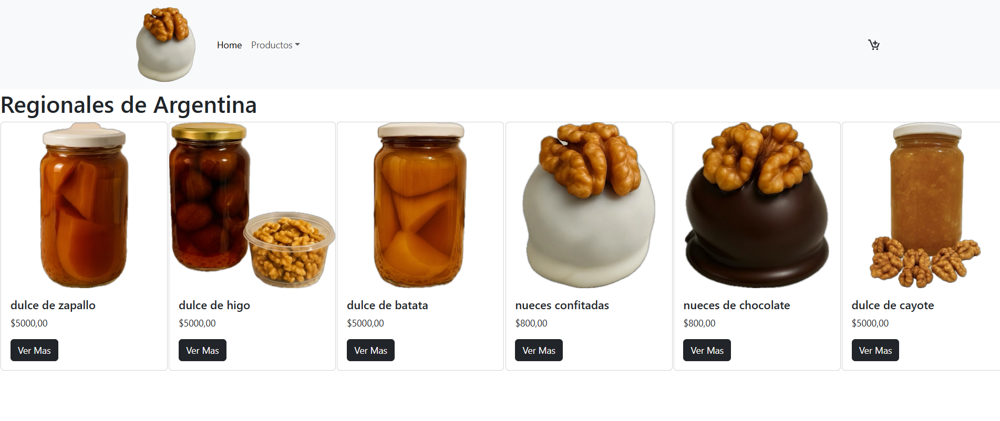

# 🧉 Regionales de Argentina

Este proyecto fue desarrollado para mostrar y vender productos regionales típicos de Argentina utilizando **React + Vite** y **Firebase** como base de datos.



---

## 🔗 Repositorio en GitHub

Podés acceder al código completo acá 👇  
👉 **https://github.com/JAgustinLT/regionales-react.git**

---

## 🌐 Proyecto Online (Deploy)

El proyecto está publicado y funcionando en Vercel:  
👉 **https://regionales-react.vercel.app/**

---

## ⚙️ Instalación (Modo Local)

📂 Ingresar al proyecto

cd regionales-react

📥 Instalar dependencias

npm install

▶️ Iniciar el proyecto en modo desarrollo

npm run dev


### 📦 Clonar el repositorio
```bash
git clone https://github.com/JAgustinLT/regionales-react.git


| Librería             | Uso                            |
| -------------------- | ------------------------------ |
| **Firebase**         | Base de datos y autenticación  |
| **React Router DOM** | Navegación entre rutas         |
| **React Bootstrap**  | Estilos y componentes visuales |
| **Vite**             | Entorno de desarrollo rápido   |


| Comando           | Función                           |
| ----------------- | --------------------------------- |
| `npm install`     | Instala dependencias              |
| `npm run dev`     | Ejecuta el proyecto               |
| `npm run build`   | Genera la versión para producción |
| `npm run preview` | Previsualiza el build             |


Desarrollado por Agustín Lopez Torres


